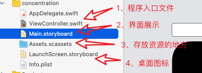
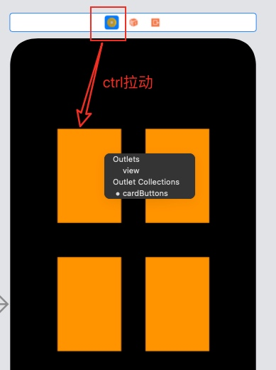
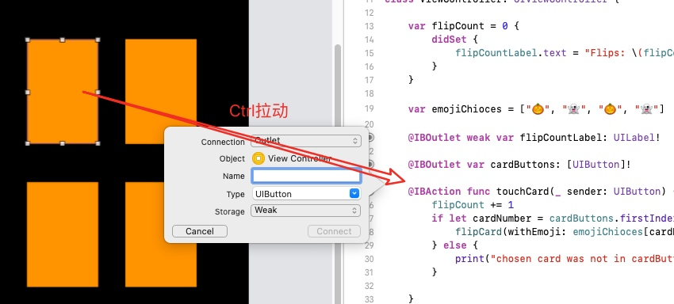
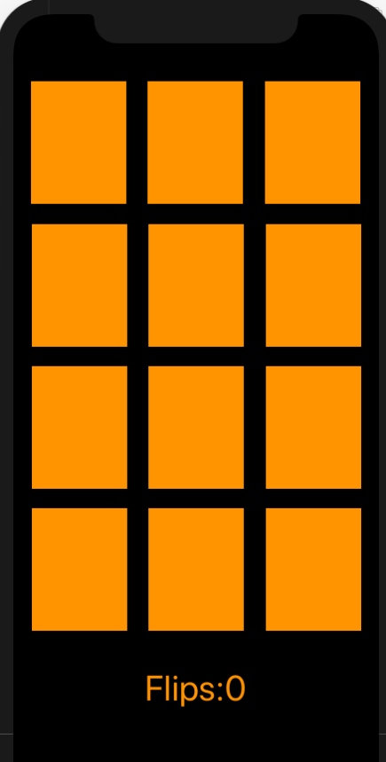
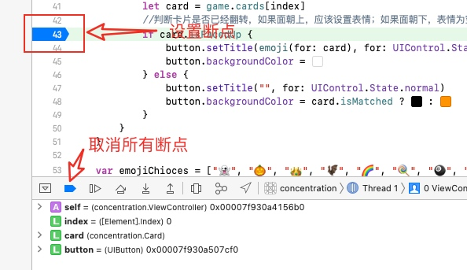

# IOS开发学习笔记
课程：斯坦福大学公开课-Bilibili  
开发语言：swift  
网址：https://www.bilibili.com/video/BV1Mx411L7dS?spm_id_from=333.999.0.0
## 1、环境配置
操作系统：[macos Big Sur 11.6.5](https://pan.baidu.com/s/1XEshh9ROKHCDOpFQwyEhiA )(提取码：w5n2)  
xcode版本：[xcode10.3](https://developer.apple.com/download/all/?q=xcode%2010.3)  
ios-app文件目录介绍：  

Main.stroyboard面板中将视图与cardButtons变量关联

在代码中注册控件，或定义对应的操作方法

代码实现：实现卡片的展示与翻转
```
import UIKit

class ViewController: UIViewController {

    //翻转次数，didset用于当变量值更改时同步更改控件的值
    var flipCount = 0 {
        didSet {
            flipCountLabel.text = "Flips: \(flipCount)"
        }
    }
    
    var emojiChioces = ["🎃", "👻", "🎃", "👻"]
    
    @IBOutlet weak var flipCountLabel: UILabel!
    
    @IBOutlet var cardButtons: [UIButton]!
    
    //当控件位于数组内时，进行翻转；否则，抛出错误
    @IBAction func touchCard(_ sender: UIButton) {
        flipCount += 1
        if let cardNumber = cardButtons.firstIndex(of: sender) {
            flipCard(withEmoji: emojiChioces[cardNumber], on: sender)
        } else {
            print("chosen card was not in cardButtons")
        }
        
    }
    
    //当控件显示表情时，将其清空；当控件内容为空，显示表情
    func flipCard(withEmoji emoji: String, on button: UIButton){
        if button.currentTitle == emoji {
            button.setTitle("", for: UIControl.State.normal)
            button.backgroundColor = #colorLiteral(red: 1, green: 0.5763723254, blue: 0, alpha: 1)
        } else {
            button.setTitle(emoji, for: UIControl.State.normal)
            button.backgroundColor = #colorLiteral(red: 1.0, green: 1.0, blue: 1.0, alpha: 1.0)
        }
    }
}
```
## 2、MVC形式重构代码
MVC: Model、View、Controller
Model:
1、Card.swift
```swift
import Foundation

struct Card {
    
    var isFacedUp = false
    var isMatched = false
    var identifier: Int
    
    static var identifierFactory = 0
    
    static func getUniqueIdentifier() -> Int {
        identifierFactory += 1
        return identifierFactory
    }
    
    init() {
        self.identifier = Card.getUniqueIdentifier()
    }
    
}
```
2、Concentration.swfit
~~~swift
import Foundation

class Contentration {
    
    var cards = [Card]()
    
    var indexOfFaceUpCard = [Int]()
    //如果点击了卡片，应该更新卡片的状态
    func chooseCard(at index: Int) {
        if !cards[index].isMatched {
            let matchIndex = indexOfFaceUpCard.count > 0 ? indexOfFaceUpCard[0] : -1
            if matchIndex != index{
                if matchIndex >= 0, cards[matchIndex].identifier == cards[index].identifier {
                    if indexOfFaceUpCard.count >= 2 {
                        cards[indexOfFaceUpCard[0]].isMatched = true
                        cards[indexOfFaceUpCard[1]].isMatched = true
                        cards[index].isMatched = true
                        indexOfFaceUpCard = []
                    } else {
                        cards[index].isFacedUp = true
                        indexOfFaceUpCard.append(index)
                    }
                } else {
                    // no cards are faced up
                    for flipDownIndex in cards.indices {
                        cards[flipDownIndex].isFacedUp = false
                    }
                    cards[index].isFacedUp = true
                    indexOfFaceUpCard = []
                    indexOfFaceUpCard.append(index)
                }
            }
        }
    }
    
    init(numberOfPairsOfCard: Int) {
        for _ in 1...numberOfPairsOfCard {
            let card = Card()
            cards += [card, card, card]
        }
        // ToDo: Shuffle the cards
    }
}
~~~
3、Controller.swift
```swift
import UIKit

class ViewController: UIViewController {
    
    lazy var game = Contentration(numberOfPairsOfCard: (cardButtons.count + 2) / 3)
    //翻转次数，didset用于当变量值更改时同步更改控件的值
    var flipCount = 0 {
        didSet {
            flipCountLabel.text = "Flips: \(flipCount)"
        }
    }
    
    @IBOutlet weak var flipCountLabel: UILabel!
    
    @IBOutlet var cardButtons: [UIButton]!
    
    //当控件位于数组内时，进行翻转；否则，抛出错误
    @IBAction func touchCard(_ sender: UIButton) {
        flipCount += 1
        if let cardNumber = cardButtons.firstIndex(of: sender) {
            game.chooseCard(at: cardNumber)
            updateViewFromModel()
        } else {
            print("chosen card was not in cardButtons")
        }
    }
    
    //更新图片的展示
    func updateViewFromModel() {
        for index in cardButtons.indices {
            //定位按钮和卡片
            let button = cardButtons[index]
            let card = game.cards[index]
            //判断卡片是否已经翻转，如果面朝上，应该设置表情；如果面朝下，表情为空
            if card.isFacedUp {
                button.setTitle(emoji(for: card), for: UIControl.State.normal)
                button.backgroundColor = #colorLiteral(red: 1.0, green: 1.0, blue: 1.0, alpha: 1.0)
            } else {
                button.setTitle("", for: UIControl.State.normal)
                button.backgroundColor = card.isMatched ? #colorLiteral(red: 0, green: 0, blue: 0, alpha: 1) : #colorLiteral(red: 1, green: 0.5763723254, blue: 0, alpha: 1)
            }
        }
    }
    
    var emojiChioces = ["👻", "🎃", "👑", "🦇", "🌈", "🍭", "🎱", "🎁"]
    
    var emoji = [Int:String]()
    
    func emoji(for card: Card) -> String {
        if emoji[card.identifier] == nil, emojiChioces.count > 0 {
            let randomIndex = Int(arc4random_uniform(UInt32(emojiChioces.count)))
            emoji[card.identifier] = emojiChioces.remove(at: randomIndex)
        }
        return emoji[card.identifier] ?? "?"
    }
} 
```
3、View


## 3、Debugging and Xcode tips
command+R : 运行程序
command+0 : 弹出左窗格
command+Alt+0 : 弹出右窗格
command+1……9 : 左窗格内容切换
command+Alt+1……2 : 右窗格内容切换
command+Shift+y : 弹出下窗格
command+Alt+Enter : 弹出辅助窗口
command+Enter : 关闭辅助窗口
command+/ : 注释代码
ctrl+I : 代码美化
Debugging：

